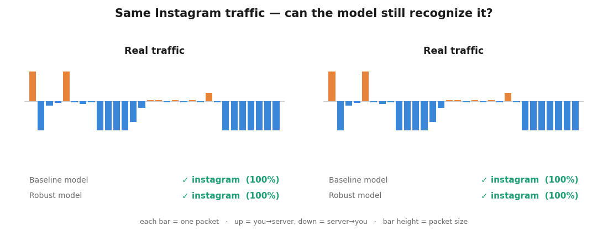

# NetEmbedAI

**Can a network figure out which app your encrypted traffic belongs to — even when someone tries to disguise it?**

That's the question this project answers. It identifies apps (YouTube, Instagram, Spotify…) from *encrypted* network traffic without ever decrypting it, and — the main contribution — it keeps working even when the traffic is deliberately **disguised to evade detection**.



*Real output from the trained models. On normal traffic, both models correctly say "Instagram." Once the traffic is disguised (padded and re-timed, but the content is unchanged), the ordinary model is fooled into a confident wrong answer — while the robust model still gets it right.*

---

## The problem, in plain words

Networks (your ISP, a company firewall, a 5G carrier) constantly need to know *what* traffic is flowing — to keep video calls smooth, manage bandwidth, or catch malware. They used to just read the data. But today almost everything is **encrypted**, so they can't look inside anymore.

The workaround: even without reading the contents, you can watch the **pattern** of the traffic — how big each packet is, which direction it goes, and its timing. Different apps have different rhythms (YouTube = big download bursts; a chat app = small back-and-forth). A model can learn those rhythms and recognize the app from the pattern alone.

**The catch:** anyone who wants to avoid being detected — malware especially — can **morph** their traffic: add junk padding, delay packets, split them up. The content stays the same, but the *pattern* changes, and ordinary classifiers get fooled. Most published models are only ever tested on clean traffic and quietly fall apart under this. **This project builds a classifier that holds up.**

## The idea

1. **Read the real rhythm.** Instead of hand-made summary statistics (the weak approach), the model reads the actual sequence of the first 30 packets — each described by its timing, direction, and size.
2. **Learn from disguised traffic.** During training, we *deliberately* disguise the traffic (jitter, padding, dropped/added/split packets). The model learns to recognize the app *through* the disguise — like a guard trained on every trick a smuggler might use.

## Does it work?

**On normal traffic — yes, easily.** It identifies the app with **~95% accuracy** on real data (the previous version of this project managed only 72–78%).

**Under disguise — this is the whole point.** A normal classifier collapses the moment traffic is morphed. The disguise-trained one holds up:

| | Normal traffic | Disguised traffic |
|---|---|---|
| Ordinary classifier | ✅ great | ❌ **falls apart** |
| Disguise-trained classifier | ✅ great | ✅ **still works** |

The most important number is the **worst case** — because a real attacker attacks your *weakest* spot. Across a battery of disguise attacks, the ordinary classifier can be pushed down to near-useless, while the fully disguise-trained model never drops below a strong score — roughly a **3.5× improvement in worst-case robustness**.

**And it's not a trick.** We tested the robust model against disguise techniques it had *never seen during training*. It still handled them — as long as they targeted the kind of change it had learned about. That rules out the "it only works because we tested it on the exact thing we trained it on" criticism.

## The honest limits

This project is deliberately upfront about what it *doesn't* do:

- **There's a cost to robustness.** Making the model disguise-proof trades away a little accuracy on clean traffic (~10 points). Robustness isn't free.
- **Robustness only covers what you train for.** The model resists the *kinds* of disguise it practiced against; a completely different trick can still hurt it. (Adding that trick to training fixes it — robustness follows what you cover.)
- **It's a research prototype, not a live product.** It doesn't sniff live traffic yet, and it's trained on one network's data, so it wouldn't be accurate on a totally different network without retraining.
- **It can't recognize brand-new apps** it was never trained on very well — that's a known hard problem in the field.

Every number in this README is measured, not idealized.

## Try the demo yourself

```bash
# Watch traffic get classified packet-by-packet, live in your terminal:
python demo_replay.py                 # random flows
python demo_replay.py --app youtube   # pick an app
python demo_replay.py --morph         # disguise it and watch the model react
```

You'll see the packets stream in, the model's guess grow more confident as data arrives, and — with `--morph` — how disguising the traffic changes the outcome.

## The numbers (for the curious)

Real CESNET-QUIC22 data, 10 apps, macro-F1:

| Model | Clean | Disguised | Worst-case (any attack) |
|---|---|---|---|
| Ordinary (supervised) | 0.91 | 0.21 | 0.18 |
| Disguise-trained (timing/size) | 0.88 | 0.76 | 0.18 |
| Disguise-trained (all attack types) | 0.81 | — | **0.64** |

A causal **TCN** does the classifying — it's fast, works packet-by-packet (so it could run live), and beats an LSTM/BiLSTM baseline while using fewer parameters.

## Reproduce

```bash
pip install torch cesnet-datazoo scikit-learn matplotlib

python -m src.data.cesnet_loader                                    # download + build data (~2.7 GB once)
python -m src.train.train --mode supervised  --encoder tcn          # ordinary model
python -m src.train.train --mode contrastive --morph --encoder tcn  # disguise-trained model
python -m src.train.train --mode contrastive --morph --broad_aug --encoder tcn \
    --tag tcn_contrastive_broadmorph                                # robust to all attack types

python -m src.eval.compare              # results table
python -m src.eval.robustness --tags tcn_supervised tcn_contrastive_morph
python -m src.eval.heldout_attacks      # test against unseen disguise techniques
```

## Layout

```
src/
  data/    cesnet_loader.py   augment.py (the disguise/morph logic)   transforms.py
  models/  tcn.py  lstm.py  heads.py
  losses/  supcon.py
  train/   train.py           # ordinary / disguise-trained / hold-out
  eval/    compare.py  robustness.py  embeddings.py  fewshot.py  heldout_attacks.py
demo_replay.py                # the live terminal demo
```

See [ROADMAP.md](ROADMAP.md) for the design rationale and what's intentionally left as future work.
